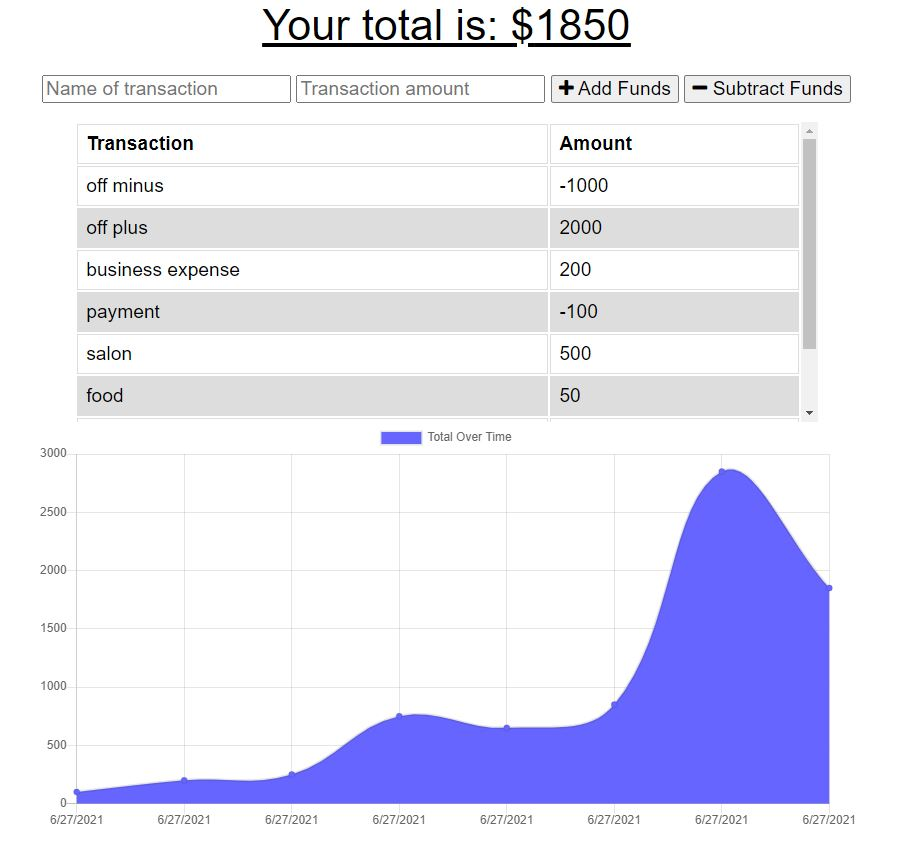

# Budget Tracker

## Description
This application will allow the user to track their budget easily when on or offline using a computer or phone. You can find the deployed application [here](https://emily-budget-tracker.herokuapp.com/). 

----
## Table Of Contents
* [Usage](#usage)
* [Contributions](#contributions)
* [Questions](#questions)
* [Screenshot](#screenshot)

----
## Usage
To use the application, visit the URL [here](https://emily-budget-tracker.herokuapp.com/). You and add transaction name and amount into teh fields to view an output of spending.

----
## Contributors
Starter code was provided in the assignment start-up. [Emily Salinas](https://github.com/Emilyrh1058) implemented the Service Worker file, idb file, an the Manifest file.

----
## Questions
Should there be any further questions please [email](mailto:emilyrh1058@gmail.com) me or visit my GitHub profile [here](https://github.com/Emilyrh1058/Budget-Tracker).

----
## Screenshot

